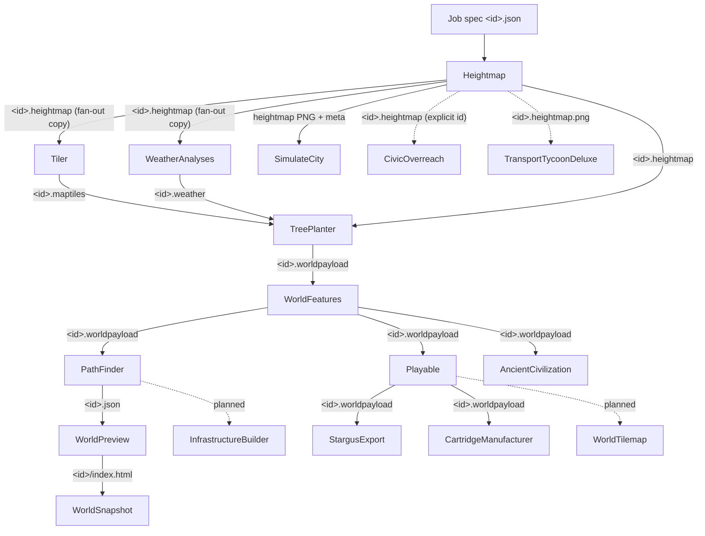

# Pipeline Data-Flow Graph and Lifecycle (Baseline)

Derived from the consumes/produces mapping in [stage-inventory.md](stage-inventory.md), not
from the linear order in `MapGenerator/stages.md` (which is wrong in several places). Solid
edges are wired data flows; dotted edges are planned or explicit-id invocations.

## Branch and terminal facts (corrected against code)

- **Heightmap fans out** to Tiler, WeatherAnalyses, SimulateCity, and (by explicit id)
  CivicOverreach / TransportTycoonDeluxe. WeatherAnalyses runs off Heightmap, **not** Tiler.
- **WorldFeatures fans out** to PathFinder, Playable, **and** AncientCivilization — all three
  default their input to `WorldFeatures/outbox`. Playable and PathFinder are parallel
  siblings, **not** sequential (contradicting `stages.md`'s "PathFinder → Playable").
- **Terminal sinks** (nothing in-repo consumes their output): StargusExport,
  CartridgeManufacturer, WorldSnapshot, AncientCivilization, SimulateCity, CivicOverreach,
  TransportTycoonDeluxe.
- **Planned / not wired:** WorldTilemap, InfrastructureBuilder.

## Lane lifecycle

Standard contract (`docs/Stage_Contract.md`): a systemd `.path` unit watches `inbox/`, fires
a oneshot `.service` running `bin/consume_*_job.sh`, which validates → invokes the engine →
writes `outbox/` → moves the input to `archive/` (success) or `failed/` (failure). `debug/`
is human-only. **Completion is detected purely by artifact presence in `outbox/`** — no IPC,
no database. `tools/mapgenctl` polls those outboxes.

### Per-stage deviations from the standard lane contract

- **Heightmap, WeatherAnalyses, Tiler** — follow the full contract (atomic claim, FIFO by
  mtime, `mv` to archive/failed). Heightmap additionally fan-out-copies into downstream
  inboxes and runs a Python PNG export.
- **WorldFeatures, PathFinder, Playable, AncientCivilization** — **pull from the upstream
  outbox** via `--input <dir>`; they do not use their own `inbox/` and never archive. Idempotency
  is "skip if output already exists".
- **StargusExport, CartridgeManufacturer, WorldPreview** — process the **newest** job only
  (`ls -t | head -1`) from an upstream outbox. CartridgeManufacturer archives the payload and
  logs JSONL harness pass/fail; the others overwrite output.
- **WorldSnapshot** — pulls the latest WorldPreview `index.html`; skips if the `.png` exists;
  distinct exit codes (2 = Playwright missing, 3 = timeout).
- **CivicOverreach** — **no queue consumer at all**; only `run_civic_overreach.sh <id>` with
  an explicit id, using `inbox/<id>/` as a scratch working dir.
- **SimulateCity** — same engine as CivicOverreach but with a consumer that picks the latest
  `Heightmap/outbox/*.heightmap`. Two near-duplicate copies of `civic_overreach.py` exist.
- **TransportTycoonDeluxe** — a scaffold consumer (placeholder JSON, full lane contract) plus
  a separate OpenTTD-headless runner.

Cross-cutting: structured per-job logs at `logs/jobs/<id>/<stage>.log` (or JSONL for
CartridgeManufacturer); a repo-root `where_I_left_off.md` continuity snapshot with timestamped
copies under `logs/leftoff_snapshots/`.
