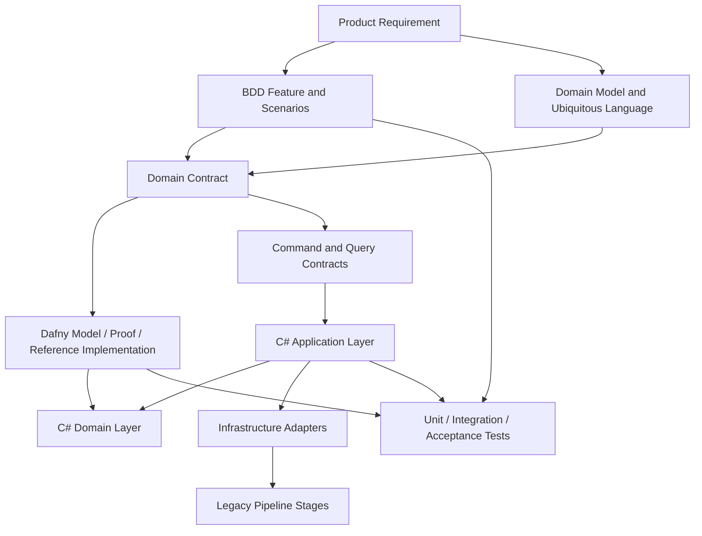
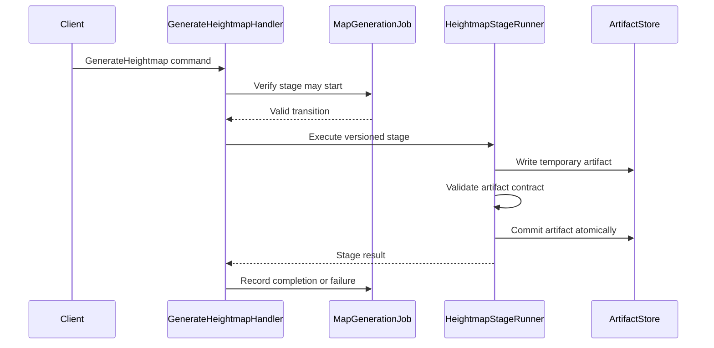

# Target Architecture

## Architectural Shape

The target architecture combines DDD, Clean Architecture, CQRS, formal specifications, and compatibility adapters.



## Recommended Solution Structure

```text
MapGenerator/
├── docs/
│   ├── product/
│   ├── architecture/
│   ├── adr/
│   └── verification/
├── features/
│   ├── terrain-generation/
│   ├── tile-resolution/
│   ├── vegetation/
│   ├── traversal/
│   └── pipeline-lifecycle/
├── specifications/
│   ├── Common/
│   ├── TerrainGeneration/
│   ├── TileResolution/
│   ├── Vegetation/
│   ├── Traversal/
│   └── PipelineLifecycle/
├── src/
│   ├── MapGen.Domain/
│   ├── MapGen.Application/
│   ├── MapGen.Contracts/
│   ├── MapGen.Infrastructure/
│   ├── MapGen.Worker/
│   └── MapGen.Cli/
├── tests/
│   ├── MapGen.Domain.Tests/
│   ├── MapGen.Application.Tests/
│   ├── MapGen.Infrastructure.Tests/
│   ├── MapGen.AcceptanceTests/
│   ├── MapGen.CompatibilityTests/
│   └── MapGen.ArchitectureTests/
├── legacy/
│   ├── Heightmap/
│   ├── WeatherAnalyses/
│   ├── Tiler/
│   └── TreePlanter/
└── justfile
```

The existing stage directories may remain in their current locations initially. The structure above represents the target organization and can be introduced gradually.

## Clean Architecture Layers

### Domain

Contains:

- entities;
- value objects;
- aggregates;
- domain services;
- invariants;
- domain events;
- typed failures;
- interfaces required by the domain.

The Domain project should not reference infrastructure, file formats, systemd, database libraries, or CLI frameworks.

### Application

Contains:

- commands;
- queries;
- handlers;
- validators;
- transaction and idempotency orchestration;
- application-level authorization;
- ports to repositories and external stage runners.

Handlers should coordinate. They should not contain the core coordinate math, path-validity logic, or terrain invariants.

### Contracts

Contains stable boundary types:

- command contracts;
- query contracts;
- artifact metadata contracts;
- integration events;
- versioned DTOs.

DTOs should not replace domain entities internally.

### Infrastructure

Contains:

- filesystem adapters;
- binary artifact readers and writers;
- JSON serialization;
- legacy process invocation;
- database repositories;
- system clock;
- logging;
- process execution;
- systemd and watcher integration.

### Worker and CLI

Contain composition roots and entry points:

- dependency injection;
- configuration;
- command parsing;
- background worker hosting;
- health checks;
- operational commands.

## CQRS Use Cases

### Commands

Possible commands include:

```text
SubmitMapGenerationJob
GenerateHeightmap
AnalyzeWeather
ResolveTiles
PlanVegetation
GenerateWorldFeatures
EnsureTraversalAccess
RetryFailedStage
ArchiveCompletedJob
CancelMapGenerationJob
```

Commands should be named as requested actions.

### Queries

Possible queries include:

```text
GetMapGenerationJob
GetPipelineStageStatus
GetArtifactManifest
InspectHeightmap
InspectTileMap
GetVegetationSummary
GetTraversalDiagnostics
ListFailedJobs
```

Queries must not mutate pipeline state.

## Example Command Flow



## Artifact Boundaries

Each stage output should have:

- a versioned schema;
- a unique job identifier;
- the stage name and stage version;
- input artifact hashes;
- configuration hash;
- seed when applicable;
- dimensions;
- output hash;
- creation timestamp for observability;
- deterministic logical identity independent of timestamp;
- validation result.

Binary formats may remain, but they should be accompanied by a manifest or a reader capable of exposing this metadata.

## Legacy Compatibility Layer

During migration, each legacy stage is treated as an external implementation behind an interface.

Example:

```csharp
public interface ITileResolutionStage
{
    Task<TileResolutionResult> ExecuteAsync(
        TileResolutionRequest request,
        CancellationToken cancellationToken);
}
```

Initial implementation:

```text
LegacyTilerProcessAdapter
```

Future implementation:

```text
VerifiedCSharpTileResolutionStage
```

The application layer should not need to know which implementation is active.

## DDD and Pipeline Stages

A pipeline stage is not automatically a bounded context. Boundaries are based on language, rules, ownership, and change patterns.

For example, tile resolution and vegetation planning have different invariants even though one follows the other operationally. They should not share a large mutable domain model merely because they are adjacent in the pipeline.
