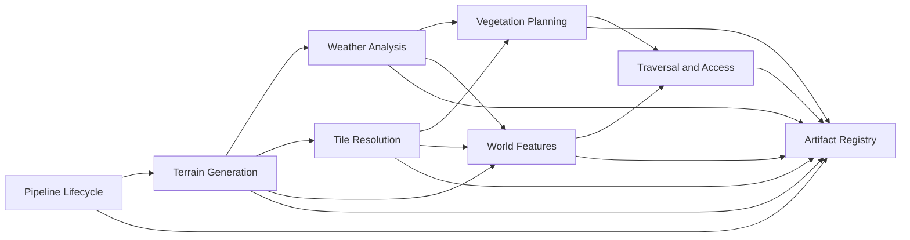

# Bounded Contexts and Ownership

## Proposed Context Map



## 1. Pipeline Lifecycle

### Owns

- jobs;
- stage dependencies;
- stage attempts;
- retries;
- cancellation;
- completion;
- archival;
- idempotency;
- orchestration state.

### Does Not Own

- terrain-generation algorithms;
- tile adjacency rules;
- tree suitability;
- pathfinding logic.

### Aggregate Candidate

`MapGenerationJob`

### Important Invariants

- required stages run only when dependencies are satisfied;
- one logical stage may have multiple attempts but only one accepted output;
- a successful stage references a committed artifact;
- cancellation prevents new work from starting;
- archival occurs only after terminal completion.

## 2. Terrain Generation

### Owns

- height-field creation;
- terrain-layer creation;
- terrain dimensions;
- seed interpretation;
- generation parameters.

### Aggregate or Service Candidates

- `TerrainGenerationRequest`
- `GeneratedTerrain`
- `HeightmapGenerator`

### Important Invariants

- dimensions are positive;
- height and terrain layers have equal cell counts;
- values remain in valid ranges;
- deterministic mode is reproducible.

## 3. Weather Analysis

### Owns

- flow accumulation;
- wetness;
- hydrology-derived metadata;
- analysis diagnostics.

### Important Invariants

- output dimensions match the heightmap;
- every cell has a valid analysis result;
- neighbour references remain in bounds;
- fixed inputs produce fixed outputs.

## 4. Tile Resolution

### Owns

- conversion from terrain cells to display or simulation tiles;
- adjacency masks;
- tile identifiers;
- cell-to-tile expansion;
- tile-map dimensions.

### Value Objects

- `CellCoordinate`
- `CellMapDimensions`
- `TileCoordinate`
- `TileMapDimensions`
- `AdjacencyMask`
- `TileIdentifier`
- `TileRegion`

### Important Invariants

- one cell expands to exactly four unique tiles;
- tile coordinates are in bounds;
- masks contain only supported directions;
- every resolved tile identifier is valid;
- resolution is deterministic for fixed inputs.

## 5. Vegetation Planning

### Owns

- vegetation suitability;
- tree type selection;
- placement density;
- deterministic placement;
- vegetation-plan output.

### Important Invariants

- vegetation remains in bounds;
- no prohibited terrain receives vegetation;
- density limits are respected;
- tree type matches suitability rules;
- deterministic seed handling is explicit.

## 6. World Features

### Owns

- natural features;
- resource deposits;
- caves;
- ramps and world-scale features not created solely for traversal;
- feature-placement constraints.

### Important Invariants

- features do not invent or overwrite prohibited terrain;
- features reference valid coordinates;
- feature dependencies are satisfied;
- outputs remain compatible with later traversal analysis.

## 7. Traversal and Access

### Owns

- traversability;
- routes;
- access diagnostics;
- approved infrastructure interventions;
- route cost.

### Possible Actions

- clear vegetation;
- build bridge;
- build stair;
- build ramp;
- create ferry connection.

### Important Invariants

- a successful route is valid from start to destination;
- every path step is adjacent;
- every non-traversable step has an approved intervention;
- interventions do not violate world constraints;
- pathfinding terminates or returns an explicit failure.

## 8. Artifact Registry

This may begin as an infrastructure service and later become a bounded context if artifact history, lineage, and promotion become complex.

### Owns

- artifact identities;
- schema versions;
- hashes;
- lineage;
- stage versions;
- logical versus physical locations;
- validation status.

### Important Invariants

- committed artifacts are immutable;
- an artifact hash matches its content;
- lineage points to existing input artifacts;
- schema versions are explicit;
- temporary artifacts are never presented as committed.

## Shared Kernel Guidance

Keep the shared kernel very small.

Suitable shared concepts:

- `JobId`
- `ArtifactId`
- `ArtifactHash`
- `MapDimensions`
- `Seed`
- `StageVersion`

Avoid sharing:

- large mutable map objects;
- stage-specific entities;
- persistence models;
- framework DTOs;
- unversioned binary structs.

## Integration Style

Prefer published, versioned contracts between contexts.

Examples:

```text
HeightmapProduced
WeatherAnalysisProduced
TileMapProduced
VegetationPlanProduced
TraversalPlanProduced
StageFailed
```

Within one process, Mediator may dispatch messages. The contracts should remain independent of the mediator library so they can later cross process boundaries if needed.
