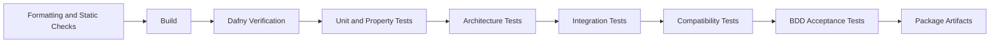

# CI Quality Gates

## Objective

CI should make the specification-driven workflow enforceable for humans and coding agents.

## Proposed Pipeline



## Gate 1 — Repository Hygiene

Check:

- formatting;
- no generated build output committed unintentionally;
- no secrets;
- no unresolved merge markers;
- documentation links resolve inside the repository;
- required files exist for domain-changing changes.

## Gate 2 — Build

Build all maintained components.

During migration this may include:

- C# solution;
- Rust stages;
- PHP TreePlanter checks;
- Kotlin PathFinder when introduced;
- Python CLI checks.

## Gate 3 — Dafny Verification

Run verification for every `.dfy` file.

Fail when:

- verification fails;
- a specification file is skipped unexpectedly;
- prohibited assumptions are introduced;
- warnings designated as errors occur.

A later custom check can reject new uses of:

```text
assume
{:axiom}
```

unless an allowlist entry and ADR exist.

## Gate 4 — Domain Unit Tests

Run:

- xUnit domain tests;
- FluentValidation tests for application inputs;
- property-based tests for transformations and invariants.

## Gate 5 — Architecture Tests

Protect dependency rules:

- Domain references no Infrastructure project;
- Application does not reference Worker or CLI;
- handlers do not directly use filesystem APIs;
- domain types do not reference serialization frameworks;
- commands and queries are separate;
- context-specific domain types do not leak across boundaries.

## Gate 6 — Integration Tests

Use temporary directories and controlled fixtures to test:

- artifact writes;
- atomic moves;
- binary readers;
- JSON manifests;
- legacy process adapters;
- retry behaviour;
- log correlation;
- database repositories when introduced.

## Gate 7 — Compatibility Tests

For migrating stages:

1. run the legacy implementation;
2. run the replacement implementation;
3. normalize irrelevant metadata;
4. compare logical output;
5. store a human-readable diff on failure.

Compatibility modes:

- exact binary match;
- exact logical match;
- tolerance-based numeric match;
- approved behavioural change.

## Gate 8 — Acceptance Tests

Execute Gherkin scenarios against the assembled application.

A scenario should call commands through the same public boundary used by real clients where practical.

## Gate 9 — Artifact and Manifest Validation

Before publishing:

- verify schema version;
- verify artifact hash;
- verify manifest lineage;
- verify stage version;
- verify no temporary file is published;
- verify required debug artifacts when debug mode is enabled.

## Pull Request Policy

A pull request that changes domain behaviour must include at least one of:

- new or modified BDD scenario;
- new or modified contract;
- written justification that behaviour is unchanged.

A pull request that modifies a Dafny contract requires human approval.

An agent may implement a reviewed contract but may not silently redefine acceptance.

## Suggested `justfile` Commands

```make
default:
    just --list

format:
    dotnet format
    # Add language-specific formatters.

build:
    dotnet build

verify:
    dafny verify specifications/**/*.dfy

test-unit:
    dotnet test tests/MapGen.Domain.Tests
    dotnet test tests/MapGen.Application.Tests

test-integration:
    dotnet test tests/MapGen.Infrastructure.Tests

test-compatibility:
    dotnet test tests/MapGen.CompatibilityTests

test-acceptance:
    dotnet test tests/MapGen.AcceptanceTests

quality:
    just format
    just build
    just verify
    just test-unit
    just test-integration
    just test-compatibility
    just test-acceptance
```

The exact syntax should be adjusted to the installed `just` version and repository layout.

## Branch Protection Recommendation

Require:

- quality workflow passes;
- at least one human review;
- contract changes receive designated-owner approval;
- direct pushes to `develop` and `main` are disabled;
- agents work only in feature branches;
- merge commits or squash policy is explicitly selected;
- release tags identify stage and schema versions.
