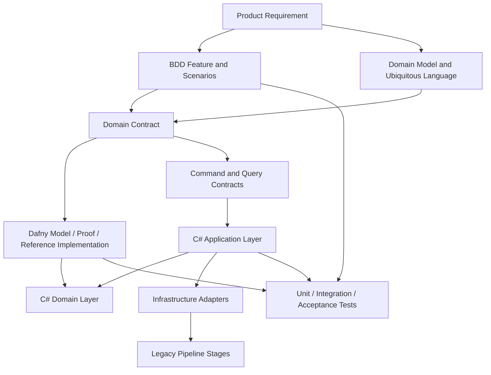
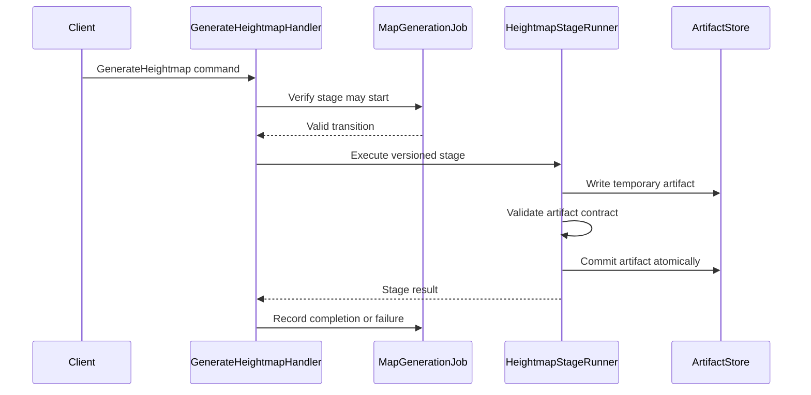
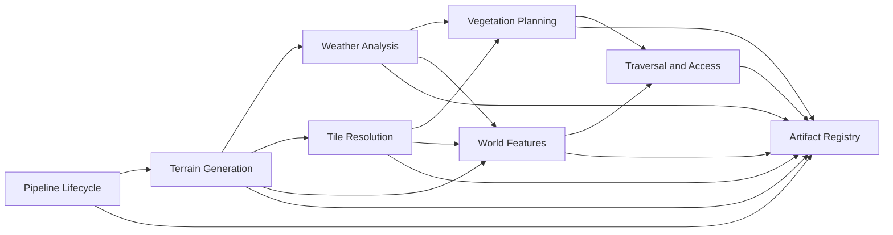
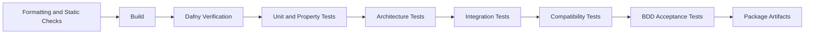

# Map Generation Pipeline — Specification-Driven Planning Bible

_Combined planning, architecture, migration, verification, and agent-operating guidance._


---


<!-- Source: 00-README.md -->


# Map Generation Pipeline — Specification-Driven Migration Plan

## Purpose

This planning pack describes how to migrate the existing filesystem-driven Map Generation Pipeline toward a specification-driven architecture using:

1. Product requirements
2. BDD scenarios
3. Domain contracts
4. Dafny models and proofs
5. Domain-Driven Design
6. CQRS
7. C# production implementations
8. Integration and acceptance tests

The goal is not to rewrite the entire pipeline at once. The goal is to introduce a repeatable workflow in which each important domain rule becomes:

- understandable to a product owner;
- expressible as executable examples;
- captured as a formal contract;
- verified where practical;
- implemented through explicit commands and queries;
- protected by automated tests and CI quality gates.

## Target Development Flow

```text
Product requirement
        ↓
BDD scenarios
        ↓
Bounded context and domain model
        ↓
Domain contract
        ↓
Dafny model, proof, or verified reference implementation
        ↓
CQRS command/query design
        ↓
C# production implementation
        ↓
Unit, integration, and acceptance tests
        ↓
Observed production behaviour and feedback
```

DDD is not a single step after the specification. It shapes the language, ownership, boundaries, and invariants throughout the process.

CQRS is not simply a folder layout. It provides explicit use cases through commands and queries and keeps orchestration separate from domain rules.

Dafny is used selectively for correctness-critical rules. It is not required for controllers, file watching, logging configuration, dependency injection, or other framework plumbing.

## Current Pipeline

The current system contains or plans the following stages:

| Stage | Current implementation | Responsibility |
|---|---|---|
| Heightmap | Rust | Deterministic terrain height generation |
| WeatherAnalyses | Rust | Hydrology, flow accumulation, and wetness |
| Tiler | C# | Convert cells into resolved tiles |
| TreePlanter | PHP | Deterministic vegetation placement |
| WorldFeatures | Planned | Add natural and world features |
| PathFinder | Planned Kotlin | Ensure traversal and infrastructure access |
| Orchestration | Python, systemd, filesystem | Submit, watch, route, archive, inspect, and log jobs |

## Recommended Migration Strategy

Use an incremental strangler approach:

1. Preserve the existing file formats and stage boundaries.
2. Introduce specifications around one rule at a time.
3. Add C# contracts and adapters around existing stages.
4. Replace a stage only after its behaviour is characterized.
5. Maintain compatibility tests between old and new implementations.
6. Retire legacy implementations only after verified parity and operational confidence.

## Documents

- `01-vision-and-principles.md` — goals, non-goals, and operating principles.
- `02-target-architecture.md` — bounded contexts, layers, CQRS, and component relationships.
- `03-spec-to-code-workflow.md` — the required lifecycle for a feature.
- `04-migration-roadmap.md` — phased migration plan.
- `05-bounded-contexts-and-ownership.md` — proposed domain boundaries for the pipeline.
- `06-dafny-verification-strategy.md` — what to verify and how to avoid false confidence.
- `07-ci-quality-gates.md` — quality gates for agents and human contributors.
- `08-first-epic-verified-cell-to-tile.md` — the first concrete implementation epic.
- `09-agent-operating-rules.md` — constraints for coding agents.
- `10-adr-001-specification-driven-mapgen.md` — architecture decision record.

A combined version is also included as `MapGen-Spec-Driven-Planning-Bible.md`.


---


<!-- Source: 01-vision-and-principles.md -->


# Vision and Principles

## Vision

The Map Generation Pipeline will become a system in which important behaviour is defined before implementation and can be checked by multiple forms of evidence.

A feature is considered complete only when:

- the intended product behaviour is written clearly;
- representative examples exist as BDD scenarios;
- domain terms and ownership are explicit;
- critical invariants are captured as contracts;
- the implementation conforms to the contracts;
- automated tests protect integration and user-visible behaviour;
- the CI pipeline rejects specification weakening and unverified changes.

## Primary Objectives

### 1. Make agent-generated code safer

Agents should work against contracts rather than broad prose alone. Their job is to produce an implementation that satisfies existing constraints, not reinterpret the domain on every change.

### 2. Make domain behaviour visible

Rules such as determinism, valid terrain placement, path validity, job-state transitions, and resource conservation should be discoverable without reading implementation details.

### 3. Support incremental replacement

Rust, PHP, Python, Kotlin, and C# components should be replaceable gradually. The migration must not require an immediate full rewrite.

### 4. Make failure explicit

Stages should return typed success or failure results. A stage must not silently lose a job, partially write an artifact, or report success without satisfying its postconditions.

### 5. Improve reproducibility

Given the same versioned inputs, seed, configuration, and stage versions, the logical output should be reproducible.

## Guiding Principles

### Specification before implementation

A meaningful behavioural change begins in the requirement, examples, and contract. Production code follows.

### Ubiquitous language

The same domain terms should appear in product requirements, Gherkin scenarios, Dafny models, C# types, logs, and pull requests.

Examples:

- `MapGenerationJob`
- `HeightmapArtifact`
- `TileMapArtifact`
- `TerrainCell`
- `ResolvedTile`
- `VegetationPlan`
- `TraversalPath`
- `StageAttempt`
- `PipelineFailure`

### Invariants live in the domain

Controllers, handlers, file watchers, and message consumers may orchestrate work, but they must not be the only location where domain rules exist.

### CQRS expresses use cases

Commands change state or create artifacts. Queries inspect existing state or artifacts. Command handlers coordinate domain services and repositories but should remain thin.

### Dafny is selective

Use Dafny for rules where exhaustive reasoning is valuable:

- coordinate transformations;
- dimensional consistency;
- determinism contracts;
- state-transition validity;
- path validity;
- conservation rules;
- ordering and dependency rules;
- duplicate and idempotency rules.

Do not force Dafny into ordinary infrastructure code.

### Tests and proofs serve different purposes

Proofs show that an implementation satisfies a formal statement for all valid inputs.

Tests show that systems, adapters, files, frameworks, and user-visible workflows behave correctly in representative environments.

Both are required.

### No big-bang rewrite

The current pipeline remains operational during migration. Compatibility is protected with characterization tests, golden files, schema checks, and dual-run comparisons.

## Non-Goals

This plan does not attempt to:

- formally verify every line of the application;
- replace BDD with theorem proving;
- place all pipeline stages into one bounded context;
- place all logic in command handlers;
- rewrite every stage in C# immediately;
- remove the filesystem transport before an alternative is proven necessary;
- prove visual quality or game-design fun through Dafny;
- allow an agent to change specifications without review.


---


<!-- Source: 02-target-architecture.md -->


# Target Architecture

## Architectural Shape

The target architecture combines DDD, Clean Architecture, CQRS, formal specifications, and compatibility adapters.



## Recommended Solution Structure

```text
MapGenerator/
├── docs/
│   ├── product/
│   ├── architecture/
│   ├── adr/
│   └── verification/
├── features/
│   ├── terrain-generation/
│   ├── tile-resolution/
│   ├── vegetation/
│   ├── traversal/
│   └── pipeline-lifecycle/
├── specifications/
│   ├── Common/
│   ├── TerrainGeneration/
│   ├── TileResolution/
│   ├── Vegetation/
│   ├── Traversal/
│   └── PipelineLifecycle/
├── src/
│   ├── MapGen.Domain/
│   ├── MapGen.Application/
│   ├── MapGen.Contracts/
│   ├── MapGen.Infrastructure/
│   ├── MapGen.Worker/
│   └── MapGen.Cli/
├── tests/
│   ├── MapGen.Domain.Tests/
│   ├── MapGen.Application.Tests/
│   ├── MapGen.Infrastructure.Tests/
│   ├── MapGen.AcceptanceTests/
│   ├── MapGen.CompatibilityTests/
│   └── MapGen.ArchitectureTests/
├── legacy/
│   ├── Heightmap/
│   ├── WeatherAnalyses/
│   ├── Tiler/
│   └── TreePlanter/
└── justfile
```

The existing stage directories may remain in their current locations initially. The structure above represents the target organization and can be introduced gradually.

## Clean Architecture Layers

### Domain

Contains:

- entities;
- value objects;
- aggregates;
- domain services;
- invariants;
- domain events;
- typed failures;
- interfaces required by the domain.

The Domain project should not reference infrastructure, file formats, systemd, database libraries, or CLI frameworks.

### Application

Contains:

- commands;
- queries;
- handlers;
- validators;
- transaction and idempotency orchestration;
- application-level authorization;
- ports to repositories and external stage runners.

Handlers should coordinate. They should not contain the core coordinate math, path-validity logic, or terrain invariants.

### Contracts

Contains stable boundary types:

- command contracts;
- query contracts;
- artifact metadata contracts;
- integration events;
- versioned DTOs.

DTOs should not replace domain entities internally.

### Infrastructure

Contains:

- filesystem adapters;
- binary artifact readers and writers;
- JSON serialization;
- legacy process invocation;
- database repositories;
- system clock;
- logging;
- process execution;
- systemd and watcher integration.

### Worker and CLI

Contain composition roots and entry points:

- dependency injection;
- configuration;
- command parsing;
- background worker hosting;
- health checks;
- operational commands.

## CQRS Use Cases

### Commands

Possible commands include:

```text
SubmitMapGenerationJob
GenerateHeightmap
AnalyzeWeather
ResolveTiles
PlanVegetation
GenerateWorldFeatures
EnsureTraversalAccess
RetryFailedStage
ArchiveCompletedJob
CancelMapGenerationJob
```

Commands should be named as requested actions.

### Queries

Possible queries include:

```text
GetMapGenerationJob
GetPipelineStageStatus
GetArtifactManifest
InspectHeightmap
InspectTileMap
GetVegetationSummary
GetTraversalDiagnostics
ListFailedJobs
```

Queries must not mutate pipeline state.

## Example Command Flow



## Artifact Boundaries

Each stage output should have:

- a versioned schema;
- a unique job identifier;
- the stage name and stage version;
- input artifact hashes;
- configuration hash;
- seed when applicable;
- dimensions;
- output hash;
- creation timestamp for observability;
- deterministic logical identity independent of timestamp;
- validation result.

Binary formats may remain, but they should be accompanied by a manifest or a reader capable of exposing this metadata.

## Legacy Compatibility Layer

During migration, each legacy stage is treated as an external implementation behind an interface.

Example:

```csharp
public interface ITileResolutionStage
{
    Task<TileResolutionResult> ExecuteAsync(
        TileResolutionRequest request,
        CancellationToken cancellationToken);
}
```

Initial implementation:

```text
LegacyTilerProcessAdapter
```

Future implementation:

```text
VerifiedCSharpTileResolutionStage
```

The application layer should not need to know which implementation is active.

## DDD and Pipeline Stages

A pipeline stage is not automatically a bounded context. Boundaries are based on language, rules, ownership, and change patterns.

For example, tile resolution and vegetation planning have different invariants even though one follows the other operationally. They should not share a large mutable domain model merely because they are adjacent in the pipeline.


---


<!-- Source: 03-spec-to-code-workflow.md -->


# Specification-to-Code Workflow

## Required Feature Lifecycle

Every significant domain change should move through the following lifecycle.

## Step 1 — Product Requirement

The requirement explains the player, operator, or system value.

Template:

```markdown
# Requirement: <Name>

## Problem
What problem exists?

## Desired Behaviour
What should happen?

## Business or Design Value
Why does this matter?

## Scope
What is included?

## Out of Scope
What is intentionally excluded?

## Acceptance Summary
What must be true for the requirement to be accepted?
```

Example:

```markdown
# Requirement: Deterministic Cell-to-Tile Expansion

For a terrain cell at coordinate `(x, y)`, the tiler must create exactly four
tile coordinates in the corresponding 2×2 tile region.

The same input cell must always produce the same coordinates.
No generated coordinate may fall outside the expanded tile map.
```

## Step 2 — BDD Scenarios

BDD captures examples understandable to non-specialists.

```gherkin
Feature: Expand terrain cells into tiles

  Rule: One cell produces one 2 by 2 tile region

  Scenario: Expand the origin cell
    Given a terrain map with a width of 10 cells and a height of 10 cells
    When cell 0,0 is expanded
    Then the generated tile coordinates are:
      | x | y |
      | 0 | 0 |
      | 1 | 0 |
      | 0 | 1 |
      | 1 | 1 |

  Scenario: Expand a cell near the far boundary
    Given a terrain map with a width of 10 cells and a height of 10 cells
    When cell 9,9 is expanded
    Then all generated tile coordinates are inside a 20 by 20 tile map
```

BDD should emphasize observable behaviour. It should not attempt to enumerate every mathematical input.

## Step 3 — Bounded Context and Domain Model

Before writing code, identify:

- the bounded context that owns the rule;
- the aggregate or domain service responsible;
- the value objects involved;
- the ubiquitous language;
- upstream inputs;
- downstream outputs;
- invariants;
- failure modes.

Example:

```text
Bounded Context: Tile Resolution
Domain Service: CellExpander
Inputs: TerrainCellCoordinate, CellMapDimensions
Output: TileRegion
Invariant: TileRegion contains exactly four unique in-bounds coordinates
```

## Step 4 — Domain Contract

Write the contract independently of framework and storage concerns.

Contract questions:

- What must be true before the operation?
- What must be true afterward?
- What cannot change?
- What failures are valid?
- Is the operation deterministic?
- Is the operation idempotent?
- What relationships must always hold?

Example:

```text
Preconditions:
- cell width and height are greater than zero;
- x is less than cell width;
- y is less than cell height.

Postconditions:
- exactly four tile coordinates are returned;
- all four coordinates are unique;
- every coordinate is inside width*2 by height*2;
- the minimum tile coordinate is x*2,y*2;
- the maximum tile coordinate is x*2+1,y*2+1.
```

## Step 5 — Dafny Model or Verified Implementation

Choose one of three levels.

### Level A — Executable mathematical model

Use Dafny to define the expected relationship. The production implementation may remain in C# and be checked through tests generated from or compared against the model.

### Level B — Verified reference implementation

Create a small verified algorithm that acts as the source of truth. The C# implementation must agree with it through compatibility tests.

### Level C — Compiled verified implementation

Compile the Dafny implementation into a target language and use it directly where operationally appropriate.

Most pipeline features should begin at Level A or Level B.

## Step 6 — CQRS Design

Define the use case explicitly.

Example command:

```csharp
public sealed record ResolveTileRegionCommand(
    Guid JobId,
    CellCoordinate Cell,
    CellMapDimensions Dimensions);
```

Example result:

```csharp
public sealed record ResolveTileRegionResult(
    TileRegion Region);
```

The command handler should:

1. validate application-level input;
2. load required state;
3. call the domain operation;
4. persist or publish the result;
5. record observable stage state.

The handler should not reproduce domain arithmetic.

## Step 7 — C# Domain Implementation

Implement:

- immutable value objects where practical;
- explicit result or failure types;
- domain methods that enforce invariants;
- no primitive obsession for important concepts;
- no framework dependencies in the domain;
- deterministic functions for deterministic rules.

## Step 8 — Tests

### Unit tests

Protect:

- domain examples;
- boundary cases;
- failure cases;
- value-object validation.

### Property-based tests

Protect mathematical relationships over many generated inputs.

Recommended use:

- coordinate transforms;
- round trips;
- determinism;
- uniqueness;
- bounds;
- conservation.

### Compatibility tests

Compare legacy and replacement stage outputs at the logical level.

Ignore non-deterministic metadata such as timestamps when it is not part of the contract.

### Integration tests

Protect:

- readers and writers;
- process adapters;
- database persistence;
- filesystem transitions;
- message handling;
- atomic artifact commits.

### Acceptance tests

Execute BDD scenarios against the assembled application.

## Step 9 — Pull Request Evidence

Each domain-changing pull request should include:

```markdown
## Requirement
Link or path.

## BDD
Scenarios added or changed.

## Contract
Invariants added or changed.

## Dafny
Verification result and files affected.

## CQRS
Commands, queries, handlers, or events affected.

## Compatibility
Old-versus-new comparison status.

## Risks
Known limitations and migration concerns.
```

## Definition of Done

A feature is complete when:

- the requirement is approved;
- BDD scenarios are executable;
- the owning bounded context is identified;
- contracts are explicit;
- relevant Dafny specifications verify;
- command/query boundaries are clear;
- C# domain code enforces the same rules;
- unit and integration tests pass;
- acceptance tests pass;
- compatibility is demonstrated if replacing legacy code;
- no specification was weakened without human approval.


---


<!-- Source: 04-migration-roadmap.md -->


# Migration Roadmap

## Strategy

Use a vertical, incremental migration. Select one narrow behaviour, specify it, verify it, implement it in C#, and place it behind an adapter. Avoid rewriting a complete stage before the workflow is proven.

## Phase 0 — Baseline and Safety Net

### Objectives

- record the existing pipeline behaviour;
- ensure current jobs can still run;
- capture schemas and representative artifacts;
- establish repeatable build and test commands.

### Deliverables

- stage inventory;
- file-format documentation;
- representative golden jobs;
- current stage dependency graph;
- current status-transition map;
- deterministic test seeds;
- artifact hash tool;
- compatibility test harness;
- a root `justfile`.

### Exit Criteria

- one command can run a known job through the current pipeline;
- output artifacts can be inspected and hashed;
- failures are logged by job and stage;
- current behaviour is characterized, even when imperfect.

## Phase 1 — Specification Skeleton

### Objectives

Introduce the new workflow without replacing production stages.

### Deliverables

```text
/docs/product
/features
/specifications
/src/MapGen.Domain
/src/MapGen.Application
/src/MapGen.Contracts
/tests/MapGen.Domain.Tests
/tests/MapGen.AcceptanceTests
```

Add templates for:

- product requirement;
- BDD feature;
- domain contract;
- ADR;
- command/query design;
- verification report.

### Exit Criteria

The first feature can travel from requirement to BDD to contract to Dafny to C# tests.

## Phase 2 — First Vertical Slice: Cell-to-Tile Expansion

### Objectives

Prove the workflow on a small, important, mathematically clear rule.

### Deliverables

- requirement document;
- Gherkin scenarios;
- `CellCoordinate` and `TileCoordinate` value objects;
- Dafny cell-expansion specification;
- verified in-bounds and cardinality properties;
- `ResolveTileRegionCommand`;
- C# domain implementation;
- property-based tests;
- comparison against the current Tiler.

### Exit Criteria

The new implementation agrees with the existing Tiler for selected fixtures or differences are documented and approved.

## Phase 3 — Tile Resolution Context

### Objectives

Migrate the remainder of Tiler behaviour.

### Candidate Rules

- adjacency-mask construction;
- valid terrain-mask combinations;
- tile-set lookup completeness;
- deterministic tile selection;
- dimension expansion;
- artifact schema validity.

### Deliverables

- Tile Resolution bounded context;
- versioned `.maptiles` reader/writer;
- C# stage implementation;
- legacy adapter;
- dual-run comparison mode;
- switchable production implementation.

### Exit Criteria

The C# Tile Resolution stage can replace the legacy Tiler for controlled jobs.

## Phase 4 — Pipeline Lifecycle Context

### Objectives

Make job and stage state transitions explicit and safe.

### Candidate States

```text
Submitted
Ready
Running
Succeeded
Failed
Cancelled
Archived
```

Stage attempts should be separate from the logical stage state so retries remain auditable.

### Verification Candidates

- impossible transitions are rejected;
- a completed stage has a committed artifact;
- an archived job cannot return to running;
- retry creates a new attempt;
- a job cannot report full success if a required stage failed;
- idempotent command handling does not duplicate artifacts.

### Exit Criteria

Pipeline orchestration uses explicit commands and verified transition rules.

## Phase 5 — Heightmap Context

### Objectives

Wrap and then selectively migrate the Rust Heightmap stage.

### First Steps

- document the binary format;
- create a C# reader and validator;
- define dimension and payload-size contracts;
- add deterministic fixture tests;
- retain the Rust generator behind an adapter.

### Verification Candidates

- payload length matches dimensions;
- terrain and height layers align;
- all values are in valid ranges;
- identical inputs produce identical logical output.

The generation algorithm itself may remain in Rust if it is stable and useful.

## Phase 6 — Weather Analysis Context

### Objectives

Specify hydrology outputs and their relationship to the heightmap.

### Verification Candidates

- output dimensions match input dimensions;
- flow directions reference valid neighbours;
- wetness values remain in permitted ranges;
- no missing cells;
- deterministic processing for fixed inputs.

Full physical correctness is not a suitable first formal target. Begin with structural and safety invariants.

## Phase 7 — Vegetation Planning Context

### Objectives

Move deterministic tree-placement rules into explicit domain policies.

### Candidate Rules

- no placement on prohibited terrain;
- placement remains in bounds;
- density limits are respected;
- deterministic random selection uses a defined seed;
- output references valid source artifacts;
- tree types satisfy biome and suitability constraints.

The existing PHP TreePlanter can remain as the initial implementation behind a compatibility adapter.

## Phase 8 — Traversal Context

### Objectives

Build PathFinder as a specification-first component rather than migrating an existing implementation.

### Verification Candidates

- returned path starts and ends correctly;
- every step is adjacent;
- every step is traversable or has an approved infrastructure action;
- path cost is non-negative;
- failure includes an explicit reason;
- generated bridge, stair, ramp, clearing, or ferry actions satisfy placement constraints.

Optimality proofs can be deferred. Begin by proving validity and termination.

## Phase 9 — Operational Consolidation

### Objectives

- standardize stage hosting;
- simplify filesystem orchestration;
- preserve inspectability;
- improve deployment and rollback.

### Deliverables

- C# worker host;
- explicit stage runners;
- health and readiness checks;
- versioned manifests;
- retry and dead-letter strategy;
- push-button deployment;
- rollback plan;
- migration dashboard or CLI status view.

## Suggested Milestone Order

```text
M1  Baseline and golden jobs
M2  Specification templates and CI
M3  Verified cell-to-tile slice
M4  Complete Tile Resolution migration
M5  Verified pipeline lifecycle
M6  Heightmap validation boundary
M7  Vegetation contracts
M8  Traversal built specification-first
M9  Operational consolidation
```

## Rewrite Rule

Do not rewrite a stage merely because it is written in another language.

Rewrite when at least one of the following is true:

- the current implementation blocks required domain changes;
- the behaviour cannot be reliably tested or observed;
- maintenance cost is materially high;
- the language boundary creates operational risk;
- a verified C# implementation provides clear value;
- the team has established compatibility evidence.


---


<!-- Source: 05-bounded-contexts-and-ownership.md -->


# Bounded Contexts and Ownership

## Proposed Context Map



## 1. Pipeline Lifecycle

### Owns

- jobs;
- stage dependencies;
- stage attempts;
- retries;
- cancellation;
- completion;
- archival;
- idempotency;
- orchestration state.

### Does Not Own

- terrain-generation algorithms;
- tile adjacency rules;
- tree suitability;
- pathfinding logic.

### Aggregate Candidate

`MapGenerationJob`

### Important Invariants

- required stages run only when dependencies are satisfied;
- one logical stage may have multiple attempts but only one accepted output;
- a successful stage references a committed artifact;
- cancellation prevents new work from starting;
- archival occurs only after terminal completion.

## 2. Terrain Generation

### Owns

- height-field creation;
- terrain-layer creation;
- terrain dimensions;
- seed interpretation;
- generation parameters.

### Aggregate or Service Candidates

- `TerrainGenerationRequest`
- `GeneratedTerrain`
- `HeightmapGenerator`

### Important Invariants

- dimensions are positive;
- height and terrain layers have equal cell counts;
- values remain in valid ranges;
- deterministic mode is reproducible.

## 3. Weather Analysis

### Owns

- flow accumulation;
- wetness;
- hydrology-derived metadata;
- analysis diagnostics.

### Important Invariants

- output dimensions match the heightmap;
- every cell has a valid analysis result;
- neighbour references remain in bounds;
- fixed inputs produce fixed outputs.

## 4. Tile Resolution

### Owns

- conversion from terrain cells to display or simulation tiles;
- adjacency masks;
- tile identifiers;
- cell-to-tile expansion;
- tile-map dimensions.

### Value Objects

- `CellCoordinate`
- `CellMapDimensions`
- `TileCoordinate`
- `TileMapDimensions`
- `AdjacencyMask`
- `TileIdentifier`
- `TileRegion`

### Important Invariants

- one cell expands to exactly four unique tiles;
- tile coordinates are in bounds;
- masks contain only supported directions;
- every resolved tile identifier is valid;
- resolution is deterministic for fixed inputs.

## 5. Vegetation Planning

### Owns

- vegetation suitability;
- tree type selection;
- placement density;
- deterministic placement;
- vegetation-plan output.

### Important Invariants

- vegetation remains in bounds;
- no prohibited terrain receives vegetation;
- density limits are respected;
- tree type matches suitability rules;
- deterministic seed handling is explicit.

## 6. World Features

### Owns

- natural features;
- resource deposits;
- caves;
- ramps and world-scale features not created solely for traversal;
- feature-placement constraints.

### Important Invariants

- features do not invent or overwrite prohibited terrain;
- features reference valid coordinates;
- feature dependencies are satisfied;
- outputs remain compatible with later traversal analysis.

## 7. Traversal and Access

### Owns

- traversability;
- routes;
- access diagnostics;
- approved infrastructure interventions;
- route cost.

### Possible Actions

- clear vegetation;
- build bridge;
- build stair;
- build ramp;
- create ferry connection.

### Important Invariants

- a successful route is valid from start to destination;
- every path step is adjacent;
- every non-traversable step has an approved intervention;
- interventions do not violate world constraints;
- pathfinding terminates or returns an explicit failure.

## 8. Artifact Registry

This may begin as an infrastructure service and later become a bounded context if artifact history, lineage, and promotion become complex.

### Owns

- artifact identities;
- schema versions;
- hashes;
- lineage;
- stage versions;
- logical versus physical locations;
- validation status.

### Important Invariants

- committed artifacts are immutable;
- an artifact hash matches its content;
- lineage points to existing input artifacts;
- schema versions are explicit;
- temporary artifacts are never presented as committed.

## Shared Kernel Guidance

Keep the shared kernel very small.

Suitable shared concepts:

- `JobId`
- `ArtifactId`
- `ArtifactHash`
- `MapDimensions`
- `Seed`
- `StageVersion`

Avoid sharing:

- large mutable map objects;
- stage-specific entities;
- persistence models;
- framework DTOs;
- unversioned binary structs.

## Integration Style

Prefer published, versioned contracts between contexts.

Examples:

```text
HeightmapProduced
WeatherAnalysisProduced
TileMapProduced
VegetationPlanProduced
TraversalPlanProduced
StageFailed
```

Within one process, Mediator may dispatch messages. The contracts should remain independent of the mediator library so they can later cross process boundaries if needed.


---


<!-- Source: 06-dafny-verification-strategy.md -->


# Dafny Verification Strategy

## Purpose

Dafny will provide machine-checked evidence for selected domain rules. It is a tool for eliminating classes of logic errors, not a replacement for product review, testing, or operational monitoring.

## Verification Levels

### Level 1 — Structural contracts

Verify basic relationships:

- dimensions;
- bounds;
- non-empty requirements;
- exact output counts;
- uniqueness;
- valid ranges.

Use this level first.

### Level 2 — State and transition contracts

Verify:

- allowed transitions;
- terminal-state behaviour;
- retry semantics;
- idempotency models;
- dependency ordering.

### Level 3 — Algorithm validity

Verify:

- produced paths are valid;
- all placements satisfy constraints;
- algorithms terminate;
- transformations preserve required information.

### Level 4 — Stronger properties

Potential later work:

- path optimality;
- equivalence of alternative algorithms;
- stronger determinism guarantees;
- conservation across complex operations.

Do not begin with Level 4.

## Initial Specification Modules

```text
specifications/
├── Common/
│   ├── Coordinates.dfy
│   ├── Dimensions.dfy
│   └── Results.dfy
├── TileResolution/
│   ├── CellExpansion.dfy
│   ├── AdjacencyMask.dfy
│   └── TileMapContract.dfy
├── PipelineLifecycle/
│   ├── StageState.dfy
│   └── JobTransitions.dfy
├── Vegetation/
│   ├── PlacementContract.dfy
│   └── SuitabilityContract.dfy
└── Traversal/
    ├── PathContract.dfy
    └── TraversalActions.dfy
```

## Example: Cell Expansion

```dafny
datatype Coordinate = Coordinate(x: nat, y: nat)

function ExpandCell(cell: Coordinate): seq<Coordinate>
{
  [
    Coordinate(cell.x * 2,     cell.y * 2),
    Coordinate(cell.x * 2 + 1, cell.y * 2),
    Coordinate(cell.x * 2,     cell.y * 2 + 1),
    Coordinate(cell.x * 2 + 1, cell.y * 2 + 1)
  ]
}

predicate InBounds(point: Coordinate, width: nat, height: nat)
{
  point.x < width && point.y < height
}

lemma ExpandedCellHasFourTiles(cell: Coordinate)
  ensures |ExpandCell(cell)| == 4
{
}

lemma ExpandedCellIsInBounds(
  cell: Coordinate,
  cellWidth: nat,
  cellHeight: nat)
  requires cellWidth > 0
  requires cellHeight > 0
  requires InBounds(cell, cellWidth, cellHeight)
  ensures forall tile ::
    tile in ExpandCell(cell) ==>
      InBounds(tile, cellWidth * 2, cellHeight * 2)
{
}
```

This specification should be refined as actual Dafny syntax and project conventions are established.

## Specification Review Checklist

A human reviewer should ask:

- Does the contract express the intended behaviour?
- Are the preconditions too strong?
- Are the postconditions meaningful?
- Could a broken implementation satisfy the specification?
- Does the model accidentally omit an important failure?
- Are units and coordinate systems explicit?
- Is determinism defined at the correct level?
- Are ordering requirements intentional?
- Is the specification independent of implementation details?

## Prohibited Agent Shortcuts

Agents must not:

- replace meaningful predicates with `true`;
- weaken `requires` or `ensures` clauses merely to pass verification;
- add `assume` statements to bypass proof obligations;
- introduce unchecked axioms;
- remove loop invariants without justification;
- hide failures by reducing the verified scope;
- alter the specification and implementation in the same change without clearly identifying the contract change;
- treat successful verification as proof that the product requirement is correct.

Any approved assumption must be documented with:

- why it is necessary;
- who owns the assumption;
- how it is tested or monitored;
- how it could later be removed.

## Relationship to C#

Three integration patterns are allowed.

### Pattern A — Independent model

Dafny defines expected behaviour. C# is tested against examples and generated cases from the same model.

Use when:

- integration with existing code matters;
- the C# implementation must be idiomatic;
- direct compilation from Dafny is unnecessary.

### Pattern B — Verified reference implementation

Dafny produces canonical outputs for fixtures. C# compatibility tests compare logical outputs.

Use when:

- replacing a legacy stage;
- exact behavioural parity is important;
- the algorithm is manageable in Dafny.

### Pattern C — Compiled Dafny component

The verified Dafny implementation is compiled and invoked directly.

Use when:

- the component is small and stable;
- generated-code boundaries are acceptable;
- performance and deployment are understood;
- debugging remains practical.

Pattern A is the default starting point.

## What Not to Verify First

Do not start with:

- systemd unit behaviour;
- command-line parsing;
- Serilog configuration;
- dependency injection;
- JSON formatting;
- HTML debug pages;
- framework middleware;
- process launching;
- exact visual appearance.

These remain important, but tests and operational checks are more appropriate.

## Verification Report

Each verified component should have a short report:

```markdown
# Verification Report: <Component>

## Requirement
What behaviour is being protected?

## Properties Proved
List the exact guarantees.

## Preconditions
List assumptions callers must satisfy.

## Not Proved
State important exclusions.

## Production Relationship
Explain whether Dafny is a model, reference, or compiled implementation.

## Test Relationship
Explain how C# and integration tests connect to the specification.
```


---


<!-- Source: 07-ci-quality-gates.md -->


# CI Quality Gates

## Objective

CI should make the specification-driven workflow enforceable for humans and coding agents.

## Proposed Pipeline



## Gate 1 — Repository Hygiene

Check:

- formatting;
- no generated build output committed unintentionally;
- no secrets;
- no unresolved merge markers;
- documentation links resolve inside the repository;
- required files exist for domain-changing changes.

## Gate 2 — Build

Build all maintained components.

During migration this may include:

- C# solution;
- Rust stages;
- PHP TreePlanter checks;
- Kotlin PathFinder when introduced;
- Python CLI checks.

## Gate 3 — Dafny Verification

Run verification for every `.dfy` file.

Fail when:

- verification fails;
- a specification file is skipped unexpectedly;
- prohibited assumptions are introduced;
- warnings designated as errors occur.

A later custom check can reject new uses of:

```text
assume
{:axiom}
```

unless an allowlist entry and ADR exist.

## Gate 4 — Domain Unit Tests

Run:

- xUnit domain tests;
- FluentValidation tests for application inputs;
- property-based tests for transformations and invariants.

## Gate 5 — Architecture Tests

Protect dependency rules:

- Domain references no Infrastructure project;
- Application does not reference Worker or CLI;
- handlers do not directly use filesystem APIs;
- domain types do not reference serialization frameworks;
- commands and queries are separate;
- context-specific domain types do not leak across boundaries.

## Gate 6 — Integration Tests

Use temporary directories and controlled fixtures to test:

- artifact writes;
- atomic moves;
- binary readers;
- JSON manifests;
- legacy process adapters;
- retry behaviour;
- log correlation;
- database repositories when introduced.

## Gate 7 — Compatibility Tests

For migrating stages:

1. run the legacy implementation;
2. run the replacement implementation;
3. normalize irrelevant metadata;
4. compare logical output;
5. store a human-readable diff on failure.

Compatibility modes:

- exact binary match;
- exact logical match;
- tolerance-based numeric match;
- approved behavioural change.

## Gate 8 — Acceptance Tests

Execute Gherkin scenarios against the assembled application.

A scenario should call commands through the same public boundary used by real clients where practical.

## Gate 9 — Artifact and Manifest Validation

Before publishing:

- verify schema version;
- verify artifact hash;
- verify manifest lineage;
- verify stage version;
- verify no temporary file is published;
- verify required debug artifacts when debug mode is enabled.

## Pull Request Policy

A pull request that changes domain behaviour must include at least one of:

- new or modified BDD scenario;
- new or modified contract;
- written justification that behaviour is unchanged.

A pull request that modifies a Dafny contract requires human approval.

An agent may implement a reviewed contract but may not silently redefine acceptance.

## Suggested `justfile` Commands

```make
default:
    just --list

format:
    dotnet format
    # Add language-specific formatters.

build:
    dotnet build

verify:
    dafny verify specifications/**/*.dfy

test-unit:
    dotnet test tests/MapGen.Domain.Tests
    dotnet test tests/MapGen.Application.Tests

test-integration:
    dotnet test tests/MapGen.Infrastructure.Tests

test-compatibility:
    dotnet test tests/MapGen.CompatibilityTests

test-acceptance:
    dotnet test tests/MapGen.AcceptanceTests

quality:
    just format
    just build
    just verify
    just test-unit
    just test-integration
    just test-compatibility
    just test-acceptance
```

The exact syntax should be adjusted to the installed `just` version and repository layout.

## Branch Protection Recommendation

Require:

- quality workflow passes;
- at least one human review;
- contract changes receive designated-owner approval;
- direct pushes to `develop` and `main` are disabled;
- agents work only in feature branches;
- merge commits or squash policy is explicitly selected;
- release tags identify stage and schema versions.


---


<!-- Source: 08-first-epic-verified-cell-to-tile.md -->


# Epic 1 — Verified Cell-to-Tile Expansion

## Epic Goal

Introduce the full specification-driven development workflow by replacing or wrapping one narrow part of the current Tiler:

> Convert one terrain-cell coordinate into the four tile coordinates belonging to its 2×2 tile region.

This epic is deliberately small. Its purpose is to establish the process, project structure, CI gates, and review habits before larger migration work begins.

## Product Requirement

A terrain map is represented as cells. The tile map expands each cell into a 2×2 tile region.

For every valid cell coordinate:

- exactly four tile coordinates are produced;
- all coordinates are unique;
- all coordinates are inside the expanded tile map;
- the mapping is deterministic;
- the mapping uses the agreed coordinate order.

## Ubiquitous Language

| Term | Meaning |
|---|---|
| Cell | One logical terrain position in the source map |
| Tile | One resolved position in the expanded map |
| Cell Coordinate | Zero-based `(x, y)` coordinate in cell space |
| Tile Coordinate | Zero-based `(x, y)` coordinate in tile space |
| Tile Region | The four tiles belonging to one cell |
| Cell Map Dimensions | Width and height measured in cells |
| Tile Map Dimensions | Width and height measured in tiles |

## BDD Feature

```gherkin
Feature: Expand a terrain cell into its tile region

  Rule: Each cell occupies exactly one 2 by 2 tile region

  Scenario: Expand the origin cell
    Given a cell map that is 10 cells wide and 10 cells high
    When I expand the cell at 0,0
    Then the tile region contains exactly 4 coordinates
    And the tile region contains 0,0
    And the tile region contains 1,0
    And the tile region contains 0,1
    And the tile region contains 1,1

  Scenario: Expand an interior cell
    Given a cell map that is 10 cells wide and 10 cells high
    When I expand the cell at 3,4
    Then the tile region contains 6,8
    And the tile region contains 7,8
    And the tile region contains 6,9
    And the tile region contains 7,9

  Scenario: Expand the final valid cell
    Given a cell map that is 10 cells wide and 10 cells high
    When I expand the cell at 9,9
    Then every tile coordinate is inside a tile map that is 20 tiles wide and 20 tiles high

  Scenario: Reject an out of bounds cell
    Given a cell map that is 10 cells wide and 10 cells high
    When I try to expand the cell at 10,9
    Then the operation fails because the cell coordinate is outside the cell map
```

## Domain Ownership

Bounded Context:

```text
Tile Resolution
```

Domain service:

```text
CellExpander
```

Value objects:

```text
CellCoordinate
CellMapDimensions
TileCoordinate
TileMapDimensions
TileRegion
```

## Domain Contract

### Preconditions

- map width is greater than zero;
- map height is greater than zero;
- cell `x` is less than map width;
- cell `y` is less than map height.

### Postconditions

- the result contains exactly four coordinates;
- all result coordinates are unique;
- every result coordinate is inside `(width × 2, height × 2)`;
- the coordinates are:

```text
(x × 2,     y × 2)
(x × 2 + 1, y × 2)
(x × 2,     y × 2 + 1)
(x × 2 + 1, y × 2 + 1)
```

### Determinism

Identical inputs produce an identical ordered result.

## Dafny Work Items

- define coordinate datatype;
- define in-bounds predicate;
- define `ExpandCell`;
- prove result length is four;
- prove all coordinates are in bounds;
- prove the four coordinates are unique;
- prove tile-map dimensions are exactly double cell-map dimensions;
- document assumptions and unproved properties.

## CQRS Work Items

### Command

```csharp
public sealed record ResolveTileRegionCommand(
    CellCoordinate Cell,
    CellMapDimensions Dimensions);
```

### Handler Responsibility

- validate the request;
- call `CellExpander`;
- return the resulting `TileRegion`.

For this first epic, persistence is unnecessary.

### Query

A separate query is not required for the pure operation. When the result is persisted as part of a tile-map artifact, a query such as `GetResolvedTileRegion` may be introduced.

## C# Domain Sketch

```csharp
public readonly record struct CellCoordinate(int X, int Y);
public readonly record struct TileCoordinate(int X, int Y);

public sealed record CellMapDimensions
{
    public int Width { get; }
    public int Height { get; }

    public CellMapDimensions(int width, int height)
    {
        if (width <= 0)
        {
            throw new ArgumentOutOfRangeException(nameof(width));
        }

        if (height <= 0)
        {
            throw new ArgumentOutOfRangeException(nameof(height));
        }

        Width = width;
        Height = height;
    }
}
```

The final implementation should use the project's preferred typed-result and exception policy.

## Test Plan

### Unit Tests

- origin cell;
- interior cell;
- final valid cell;
- negative coordinate;
- coordinate equal to width;
- coordinate equal to height;
- zero dimensions;
- negative dimensions.

### Property Tests

For generated valid dimensions and cells:

- result count is four;
- all coordinates are distinct;
- all coordinates are in bounds;
- minimum `x` equals `cell.x * 2`;
- maximum `x` equals `cell.x * 2 + 1`;
- minimum `y` equals `cell.y * 2`;
- maximum `y` equals `cell.y * 2 + 1`;
- a second call returns an identical result.

### Compatibility Tests

Select representative cells from current Tiler fixtures and compare the logical coordinates.

If the existing ordering differs, decide whether order is contractual or whether comparison should treat the region as a set.

## Tasks

### Planning

- [ ] Approve ubiquitous language.
- [ ] Approve coordinate ordering.
- [ ] Confirm zero-based coordinates.
- [ ] Identify current Tiler function responsible.

### Repository

- [ ] Add specification directories.
- [ ] Add C# Domain, Application, and test projects.
- [ ] Add Dafny verification command.
- [ ] Add BDD test framework.
- [ ] Add property-testing library.

### Specification

- [ ] Write requirement.
- [ ] Add Gherkin feature.
- [ ] Write domain-contract document.
- [ ] Implement Dafny model.
- [ ] Verify required lemmas.
- [ ] Add verification report.

### Implementation

- [ ] Implement value objects.
- [ ] Implement `CellExpander`.
- [ ] Add command and handler.
- [ ] Add unit tests.
- [ ] Add property tests.
- [ ] Add compatibility fixture adapter.

### CI

- [ ] Build C# projects.
- [ ] Run Dafny verification.
- [ ] Run domain tests.
- [ ] Run compatibility tests.
- [ ] Publish failure diagnostics.

## Exit Criteria

The epic is complete when:

- all BDD scenarios pass;
- all Dafny properties verify;
- property tests pass;
- the C# implementation has no infrastructure dependency;
- compatibility with the current Tiler is demonstrated or intentional differences are approved;
- CI enforces the new verification and testing steps;
- the workflow is documented well enough for an agent to repeat it.


---


<!-- Source: 09-agent-operating-rules.md -->


# Agent Operating Rules

## Purpose

These rules constrain coding agents working in the specification-driven Map Generation Pipeline.

They may be copied into `AGENTS.md` and adjusted for repository-specific commands.

## Core Rule

An agent implements reviewed behaviour. It does not silently redefine correct behaviour.

## Required Work Order

For a domain-changing feature, the agent must inspect or create artifacts in this order:

1. product requirement;
2. BDD scenarios;
3. bounded-context ownership;
4. domain contract;
5. Dafny specification where required;
6. command/query contracts;
7. C# domain implementation;
8. tests;
9. documentation and migration notes.

## Specification Protection

The agent must not:

- weaken a precondition or postcondition merely to make verification pass;
- replace a meaningful predicate with `true`;
- add `assume` or an axiom without explicit approval;
- remove a failing scenario instead of fixing behaviour;
- alter expected output fixtures without explaining why;
- hide a compatibility difference by normalizing meaningful data;
- move domain rules into handlers, controllers, CLI commands, or infrastructure adapters;
- bypass a value object by passing raw primitives through the domain;
- mark a stage successful before its artifact is committed and validated.

## Change Classification

Before implementation, classify the work as one of:

```text
Behaviour-preserving refactor
New behaviour
Behaviour correction
Specification correction
Infrastructure-only change
Compatibility migration
```

A `Specification correction` requires explicit human review.

## Required Validation

Before presenting work as complete, run the repository-equivalent commands for:

```text
format
build
dafny verification
unit tests
property tests
architecture tests
integration tests
compatibility tests
acceptance tests
```

When a command cannot run, report:

- the exact command;
- the failure;
- whether the failure existed before the change;
- what remains unverified.

## Pull Request Summary

The agent should produce:

```markdown
## What Changed

## Requirement and Scenarios

## Domain Contract

## Dafny Verification

## CQRS Design

## Tests

## Compatibility

## Risks and Follow-Up
```

## Repository Safety

- work in a feature branch;
- do not merge into `develop` or `main`;
- do not rewrite unrelated files;
- do not delete golden fixtures without approval;
- do not modify binary schemas without a version change;
- preserve backwards-compatible readers during migrations;
- make artifact writes atomic;
- keep stage logs correlated by job and attempt.

## Coding Rules

### Domain

- prefer explicit value objects;
- model failures explicitly;
- keep deterministic operations free from clocks, random globals, and filesystem access;
- use injected seed and random abstractions where randomness is intentional;
- keep invariants close to the types that own them.

### Application

- commands mutate or produce effects;
- queries read;
- handlers orchestrate and remain thin;
- validation at the boundary does not replace domain enforcement;
- publish domain or integration events only after successful state changes.

### Infrastructure

- adapters may translate formats but must not redefine domain rules;
- external process failures must be typed and logged;
- temporary files must be distinguishable from committed artifacts;
- validate artifacts before promoting them.

### Tests

- do not test only the happy path;
- use property tests for mathematical rules;
- keep acceptance scenarios understandable;
- compatibility tests compare logical meaning;
- every corrected bug receives a regression test.

## Dafny-Specific Rules

- all specification files must verify;
- ghost code may clarify proofs but must not hide missing runtime behaviour;
- loop invariants should state meaningful progress and preserved truth;
- `decreases` clauses must describe real termination;
- any timeout or verification instability must be reported;
- a verified implementation must state what was not proved.


---


<!-- Source: 10-adr-001-specification-driven-mapgen.md -->


# ADR-001: Adopt a Specification-Driven Architecture for Map Generation

- **Status:** Proposed
- **Decision Owners:** Craig Parsons and project maintainers
- **Date:** 2026-07-13

## Context

The Map Generation Pipeline contains multiple stages implemented in several languages and connected through filesystem-based job and artifact handoffs.

The pipeline is increasingly being developed with coding agents. Natural-language prompts and tests alone do not provide enough protection for correctness-critical rules such as:

- coordinate transformations;
- dimensional consistency;
- deterministic generation;
- valid state transitions;
- vegetation constraints;
- artifact lineage;
- path validity;
- retry and idempotency behaviour.

The project also intends to use DDD, Clean Architecture, CQRS, BDD, and C# for production development.

## Decision

Adopt the following development lifecycle for significant domain behaviour:

```text
Product requirement
        ↓
BDD scenarios
        ↓
Bounded context and domain model
        ↓
Domain contract
        ↓
Dafny model, proof, or verified reference implementation
        ↓
CQRS command/query design
        ↓
C# production implementation
        ↓
Integration and acceptance tests
```

Use Dafny selectively for domain rules that benefit from universal or mathematical guarantees.

Use C# as the target production language for newly migrated application and domain components unless a stage has a strong reason to remain in its current language.

Use an incremental strangler migration rather than a full rewrite.

## Rationale

This decision:

- gives agents machine-checkable constraints;
- makes domain rules visible and reviewable;
- complements BDD examples with universal properties;
- supports gradual migration;
- separates domain logic from orchestration and infrastructure;
- creates stronger CI quality gates;
- improves confidence in deterministic and boundary-sensitive algorithms.

## Consequences

### Positive

- domain behaviour becomes explicit;
- important properties can be verified for all valid inputs;
- agents receive clearer constraints;
- regressions are detected earlier;
- pipeline stages become more replaceable;
- state transitions and artifact contracts become auditable;
- C# implementation follows explicit use cases through CQRS.

### Negative

- contributors must learn Dafny concepts;
- proof maintenance adds work;
- specifications can be wrong or incomplete;
- CI becomes more complex;
- dual-run compatibility testing may be temporarily expensive;
- the repository will contain multiple representations of behaviour.

### Risks

- agents may weaken specifications;
- the team may over-verify low-value code;
- formal models may diverge from production code;
- a big-bang rewrite may be attempted despite the migration strategy;
- generated Dafny code may be adopted without sufficient operational evaluation.

## Mitigations

- require human review for contract changes;
- prohibit unapproved assumptions and axioms;
- begin with structural invariants;
- connect Dafny models to C# property and compatibility tests;
- maintain explicit verification reports;
- migrate one vertical slice at a time;
- preserve legacy adapters until parity is demonstrated.

## First Implementation

The first vertical slice will be Verified Cell-to-Tile Expansion in the Tile Resolution bounded context.

This slice will establish:

- requirement templates;
- Gherkin acceptance tests;
- Dafny verification;
- C# domain and application projects;
- CQRS conventions;
- property tests;
- compatibility tests;
- CI gates.

## Alternatives Considered

### Tests only

Rejected as the sole strategy because example-based tests cannot cover all valid coordinate, dimension, transition, and path combinations.

### Dafny for the entire system

Rejected because infrastructure and framework code do not justify the verification cost.

### Full rewrite in C#

Rejected because it creates unnecessary delivery and compatibility risk.

### Keep all current languages permanently

Not rejected categorically. Stable stages may remain in their existing languages, but they must gain explicit contracts, adapters, observability, and compatibility tests.

## Review Trigger

Revisit this ADR when:

- the first three verified vertical slices are complete;
- Dafny maintenance cost materially exceeds benefit;
- compiled Dafny integration is being considered;
- the filesystem transport is replaced;
- stage boundaries or bounded contexts materially change.


---


<!-- Source: 11-immediate-implementation-checklist.md -->


# Immediate Implementation Checklist

## Week 1 — Establish the Baseline

- [ ] Add a root `justfile`.
- [ ] Document the current stage graph.
- [ ] Save three representative golden jobs.
- [ ] Record current artifact schemas and hashes.
- [ ] Add one command that runs all existing checks.

## Week 2 — Create the Specification Spine

- [ ] Add `/docs/product`.
- [ ] Add `/features`.
- [ ] Add `/specifications`.
- [ ] Create C# Domain, Application, Contracts, and test projects.
- [ ] Add Dafny verification to CI.

## Week 3 — Complete Epic 1

- [ ] Approve cell and tile terminology.
- [ ] Write the cell-to-tile product requirement.
- [ ] Add Gherkin scenarios.
- [ ] Verify the Dafny model.
- [ ] Implement the C# domain service.
- [ ] Add CQRS command and handler.
- [ ] Add property tests.
- [ ] Compare with the current Tiler.

## Do Not Start Yet

- [ ] Do not rewrite Heightmap.
- [ ] Do not rewrite TreePlanter.
- [ ] Do not replace filesystem orchestration.
- [ ] Do not attempt optimal pathfinding proofs.
- [ ] Do not formalize visual-quality rules.


---


<!-- Source: 12-repository-placement-guide.md -->


# Repository Placement Guide

## Purpose

This guide shows how to insert the planning pack into the existing `RTSColonyTerrainGenerator/MapGenerator` setup without moving the current stages immediately.

## Recommended First Placement

```text
RTSColonyTerrainGenerator/
└── MapGenerator/
    ├── AGENTS.md
    ├── justfile
    ├── docs/
    │   ├── planning/
    │   │   ├── 00-README.md
    │   │   ├── 01-vision-and-principles.md
    │   │   ├── 02-target-architecture.md
    │   │   ├── 03-spec-to-code-workflow.md
    │   │   ├── 04-migration-roadmap.md
    │   │   ├── 05-bounded-contexts-and-ownership.md
    │   │   ├── 06-dafny-verification-strategy.md
    │   │   ├── 07-ci-quality-gates.md
    │   │   ├── 08-first-epic-verified-cell-to-tile.md
    │   │   └── 10-adr-001-specification-driven-mapgen.md
    │   ├── product/
    │   ├── contracts/
    │   ├── verification/
    │   └── adr/
    ├── features/
    ├── specifications/
    ├── src/
    ├── tests/
    ├── Heightmap/
    ├── WeatherAnalyses/
    ├── Tiler/
    ├── TreePlanter/
    ├── WorldFeatures/
    └── PathFinder/
```

Keep the existing stage folders where they are. Do not place them under `legacy/` until the new C# solution and adapters exist.

## Suggested Copy Commands

From the extracted planning-pack directory:

```bash
cd ~/Code/RTSColonyTerrainGenerator/MapGenerator

mkdir -p docs/planning
mkdir -p docs/product
mkdir -p docs/contracts
mkdir -p docs/verification
mkdir -p docs/adr
mkdir -p features
mkdir -p specifications
mkdir -p src
mkdir -p tests

cp /path/to/mapgen-spec-driven-planning/AGENTS.md ./AGENTS.md
cp /path/to/mapgen-spec-driven-planning/0*.md ./docs/planning/
cp /path/to/mapgen-spec-driven-planning/10-adr-001-specification-driven-mapgen.md ./docs/adr/ADR-001-specification-driven-mapgen.md
```

Adjust `/path/to/` to the extracted location.

## First Files to Promote from Planning into Active Work

### Product Requirement

Create:

```text
docs/product/tile-resolution/cell-to-tile-expansion.md
```

Extract the Product Requirement section from:

```text
docs/planning/08-first-epic-verified-cell-to-tile.md
```

### BDD Feature

Create:

```text
features/tile-resolution/cell-to-tile-expansion.feature
```

Copy and refine the Gherkin scenarios from Epic 1.

### Domain Contract

Create:

```text
docs/contracts/tile-resolution/cell-to-tile-expansion.contract.md
```

Copy the preconditions, postconditions, failure behaviour, and determinism rule.

### Dafny Specification

Create:

```text
specifications/TileResolution/CellExpansion.dfy
```

Begin with coordinate, bounds, cardinality, and uniqueness properties.

### C# Solution

A reasonable starting solution is:

```text
src/MapGen.Domain/
src/MapGen.Application/
src/MapGen.Contracts/
src/MapGen.Infrastructure/
tests/MapGen.Domain.Tests/
tests/MapGen.Application.Tests/
tests/MapGen.CompatibilityTests/
tests/MapGen.AcceptanceTests/
```

Do not move the current `Tiler` into these projects yet. First create an adapter and test its observable behaviour.

## First Integration Boundary

Introduce an application-facing interface:

```csharp
public interface ITileResolutionStage
{
    Task<TileResolutionResult> ExecuteAsync(
        TileResolutionRequest request,
        CancellationToken cancellationToken);
}
```

Implement it first with:

```text
ExistingTilerAdapter
```

Then build:

```text
CSharpTileResolutionStage
```

Both implementations can be run against the same fixture jobs by compatibility tests.

## Initial Branch

Suggested branch name:

```text
feature/spec-driven-mapgen-foundation
```

The branch should introduce:

- planning documents;
- `AGENTS.md`;
- empty active specification directories;
- initial solution projects;
- first Dafny verification command;
- first Epic 1 requirement and scenarios;
- no production stage replacement yet.

## Initial Commit Sequence

```text
docs: add specification-driven migration plan
build: add Dafny verification entry point
test: add cell-to-tile acceptance scenarios
feat: add tile-resolution domain value objects
spec: verify cell-to-tile expansion
feat: add CQRS command for tile-region resolution
test: compare cell expansion with existing tiler
```

This commit sequence keeps each change reviewable and teaches agents the intended progression.


---

<!-- Source: AGENTS.md -->


# AGENTS.md

## Project Mission

Develop the Map Generation Pipeline through a specification-driven workflow:

```text
Product requirement
        ↓
BDD scenarios
        ↓
Bounded context and domain model
        ↓
Domain contract
        ↓
Dafny model, proof, or verified reference implementation
        ↓
CQRS command/query design
        ↓
C# production implementation
        ↓
Unit, integration, compatibility, and acceptance tests
```

## Mandatory Work Order

For any change that modifies domain behaviour:

1. Locate or create the product requirement.
2. Locate or create BDD scenarios.
3. Identify the bounded context that owns the behaviour.
4. Write or update the domain contract.
5. Write or update the Dafny specification when the rule is verification-worthy.
6. Define commands, queries, results, and events.
7. Implement domain behaviour in C#.
8. Add unit, property, integration, compatibility, and acceptance tests as appropriate.
9. Run all available quality gates.
10. Report anything that remains unverified.

## Human-Controlled Artifacts

The following require explicit human review when their meaning changes:

- product acceptance criteria;
- BDD expected outcomes;
- domain invariants;
- Dafny `requires` clauses;
- Dafny `ensures` clauses;
- domain predicates;
- artifact schemas;
- stage-transition rules;
- compatibility normalization rules.

An agent may propose changes to these artifacts, but it must identify the proposal as a specification change. It must not silently change them to make code or proofs pass.

## Prohibited Shortcuts

Do not:

- weaken a contract merely to satisfy the verifier;
- replace a meaningful predicate with `true`;
- add `assume`, unchecked axioms, or equivalent bypasses without explicit approval;
- delete a failing test or scenario instead of correcting the behaviour;
- rewrite golden fixtures without documenting the behavioural change;
- move domain logic into command handlers, controllers, CLI commands, workers, or infrastructure adapters;
- report a stage as successful before validating and atomically committing its output artifact;
- merge directly into `develop` or `main`;
- modify unrelated code while completing a focused task.

## Domain Rules

- Use the ubiquitous language from the owning bounded context.
- Prefer explicit value objects for coordinates, dimensions, identifiers, hashes, seeds, versions, and state.
- Keep deterministic domain operations independent from clocks, filesystems, global random generators, and environment variables.
- Represent expected failure explicitly.
- Enforce invariants inside the owning domain type or service.
- Do not share large mutable models across bounded contexts.

## CQRS Rules

- Commands request a state change or effect.
- Queries retrieve information and must not mutate state.
- Command and query handlers coordinate work; they do not own core domain algorithms.
- Validation at an application boundary does not replace domain enforcement.
- Integration events use versioned contracts.
- Mediator is an implementation mechanism, not the owner of message semantics.

## Dafny Rules

- All maintained `.dfy` files must verify.
- State exactly what is proved and what is not proved.
- Use meaningful invariants and termination measures.
- Keep specifications independent of framework and persistence details.
- Default to using Dafny as a model or verified reference implementation.
- Directly compiled Dafny components require an explicit architecture decision.
- Report verification timeouts, instability, or solver-sensitive proofs.

## Testing Rules

Use:

- unit tests for examples and local domain behaviour;
- property tests for mathematical and invariant-heavy rules;
- architecture tests for dependency boundaries;
- integration tests for files, processes, databases, and adapters;
- compatibility tests when replacing a legacy implementation;
- acceptance tests for BDD scenarios.

Every corrected defect must receive a regression test.

## Artifact Safety

- Treat committed artifacts as immutable.
- Use versioned schemas.
- Include input lineage and hashes.
- Write to temporary locations first.
- Validate before atomic promotion.
- Never present a temporary or partially written artifact as complete.
- Preserve backwards-compatible readers during staged migrations.

## Expected Commands

Use the repository commands when they exist:

```text
just format
just build
just verify
just test-unit
just test-integration
just test-compatibility
just test-acceptance
just quality
```

When a command cannot run, report the exact command and reason.

## Required Completion Report

```markdown
## Change Classification

## Requirement and BDD

## Bounded Context and Contract

## Dafny Verification

## CQRS and C# Implementation

## Tests and Compatibility

## Remaining Risks or Unverified Work
```
